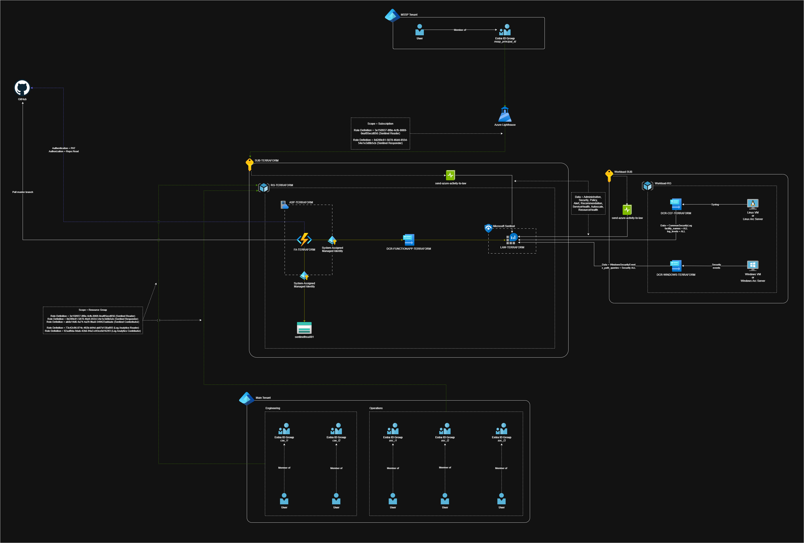

# Microsoft Sentinel – Terraform Deployment (Azure Native First)

---

## 📌 Overview

This repository contains **Terraform Infrastructure-as-Code (IaC)** to deploy and configure **Microsoft Sentinel** using an **Azure-native–first approach**, followed by **CEF/Syslog ingestion** using **Azure Monitor Agent (AMA)**, **Data Collection Rules (DCR)**, and **Azure Function App**.

The design follows **Microsoft-supported deployment patterns** and is suitable for **enterprise and MSSP environments**, including **cross-subscription architectures**.

---

## 🏗️ Architecture Summary

This deployment follows Microsoft Sentinel best practices by **separating the security control plane from log-producing workloads**.  
All security services are centralized, while workloads remain distributed across subscriptions.

### Architecture Diagram



### 🔐 Subscription Layout

```text
Subscription: SUB-TERRAFORM
├─ Resource Group
│  ├─ Log Analytics Workspace (LAW)
│  ├─ Microsoft Sentinel (enabled on LAW)
│  ├─ Data Collection Rules (AMA-based)
│  │  ├─ Windows Security Events DCR
│  │  └─ CEF / Syslog DCR
│  ├─ Azure Activity Logs (streamed to LAW)
│  ├─ Sentinel RBAC Assignments
│  ├─ Azure Lighthouse (optional, MSSP / multi-tenant)
│  └─ Function App (optional automation / integration)

Subscription: SUB-01 (Workload Subscription)
├─ Windows Virtual Machine(s)
│  ├─ Azure Monitor Agent (AMA)
│  └─ Associated to Windows Security Events DCR
│     (cross-subscription DCR association)
│
├─ Linux Virtual Machine(s)
│  ├─ Azure Monitor Agent (AMA)
│  └─ Associated to CEF / Syslog DCR
│     (cross-subscription DCR association)
```

### Key Architecture Principles

- **Microsoft Sentinel is not a data source**; it consumes data from Log Analytics.
- **Azure-native connectors are auto-detected** when data exists in the workspace.
- **CEF/Syslog ingestion is enabled via Azure Monitor Agent (AMA) and Data Collection Rules (DCR)**, not via a Sentinel connector resource.
- **Creation of required resources for Azure Function App** - Infra only.
- **Cross-subscription DCR association is supported** and commonly used in enterprise and MSSP environments.
- **Azure Lighthouse configuration** based on pre-existing template mapped to Terraform readable format.
- **Terraform manages infrastructure and configuration**, while some tenant-level features remain manual by design.

---

## Terraform File Structure (.tf Only)

This repository is organized by **functional Terraform modules**, where each `.tf` file has a clear, single responsibility.  
The structure supports **cross-subscription Microsoft Sentinel deployments**, **Azure Monitor Agent (AMA)**, and **Data Collection Rules (DCRs)**.

---

### Core Configuration

| File | Purpose |
|----|----|
| `main.tf` | Terraform providers, backend configuration, and shared settings |
| `variables.tf` | Input variables used across the deployment |
| `terraform.tfvars` | Environment-specific variable values |
| `sentinel-rbac.tf` | RBAC assignments required for Microsoft Sentinel operations |

---

### Log Analytics & Sentinel

| File | Purpose |
|----|----|
| `law-create.tf` | Creates the Log Analytics Workspace (LAW) |
| `sentinel-create.tf` | Enables Microsoft Sentinel on the LAW |

---

### Data Collection Rules (DCR)

| File | Purpose |
|----|----|
| `dcr-create.tf` | Base Data Collection Rules for AMA (CEF, Syslog, Windows Events) |
| `dcr-windows-create.tf` | Windows Security Events DCR definition |
| `dcr-cef-create.tf` | CEF / Syslog DCR definition |

---

### DCR Associations

| File | Purpose |
|----|----|
| `dcr-toWindowsVM.tf` | Associates Windows DCRs to Windows VMs |
| `dcr-toLinuxVM.tf` | Associates CEF/Syslog DCRs to Linux VMs |

---

### Data Sources (Existing Resources)

| File | Purpose |
|----|----|
| `data-windows-vm.tf` | Data source for existing Windows VMs (cross-subscription supported) |
| `data-linux-vm.tf` | Data source for existing Linux VMs (cross-subscription supported) |

---

### Azure Activity & Platform Logs

| File | Purpose |
|----|----|
| `azure-activity-logs.tf` | Enables Azure Activity Logs streaming to Log Analytics |

---

### Optional / Supporting Resources

| File | Purpose |
|----|----|
| `function-app.tf` | Optional Function App (automation, enrichment, or integration use cases) |
| `lighthouse.tf` | Azure Lighthouse configuration for MSSP / multi-tenant access |

---

### Notes

- All log ingestion uses **Azure Monitor Agent (AMA)** — legacy agents are intentionally excluded
- Cross-subscription DCR association is supported and expected
- Microsoft Sentinel **Content Hub solutions and some data connectors must be enabled manually** (by design)
- Terraform state files are intentionally excluded from documentation

---

📌 **Design Principle**  
Each `.tf` file is **atomic, readable, and reusable**, making this repository suitable for:
- Enterprise SOC deployments
- MSSP multi-tenant architectures
- CI/CD-driven Sentinel environments

---

## ✅ What This Deployment Covers

### Microsoft Sentinel Core

- Creation of a **Log Analytics Workspace (LAW)**
- Enablement of **Microsoft Sentinel** via Terraform
- Baseline Sentinel configuration ready for:
  - Analytics rules
  - Workbooks
  - Automation & playbooks
- Required **RBAC assignments** for Sentinel operations

### Azure-Native Data Sources

The following Azure-native data sources are supported and **automatically recognized by Microsoft Sentinel** once data is ingested into the workspace:

- **Azure Activity Logs**
- **Microsoft Entra ID (Azure AD) logs**
  - Sign-in logs
  - Audit logs
- **Microsoft Defender for Cloud**
- **Azure Firewall**
- **Azure Key Vault**

> ℹ️ Sentinel connector tiles for Azure-native sources are **data-driven** and do not represent configurable backend resources in Terraform.

### Windows Security Events (AMA)

- **Azure Monitor Agent (AMA)** on Windows virtual machines
- **Windows Security Events Data Collection Rule (DCR)**
- **Cross-subscription DCR association** between:
  - Sentinel subscription
  - Workload (VM) subscription
- Automatic Sentinel connector activation once events are received

### CEF / Syslog Ingestion (Modern Architecture)

- **Azure Monitor Agent (AMA)** on Linux virtual machines
- **CEF / Syslog Data Collection Rules (DCR)**
- **Cross-subscription DCR association** between:
  - Sentinel subscription
  - Workload (VM) subscription
- Automatic Sentinel connector status once logs are received

### Platform & Management Capabilities

- **Azure Activity Logs** streamed centrally to Log Analytics
- **Azure Lighthouse** (optional) for MSSP / multi-tenant access
- **Function App** (optional) for automation, enrichment, or integrations

---

📌 **Design Alignment**

This deployment strictly follows **Microsoft-recommended ingestion patterns**, uses **Azure Monitor Agent only**, and is suitable for **enterprise-scale and MSSP Sentinel deployments**.

---

## 🚫 What Is Not Automated (By Design)

The following components are intentionally **excluded from Terraform automation** due to Microsoft platform constraints or tenant-level security requirements:

### Sentinel Features
- **UEBA / Entity Analytics** – requires manual, one-time enablement per workspace
- **Fusion** and other ML-driven analytics – tenant-initialised services
- Sentinel connector tiles that are **UI-only and data-driven**

### SaaS and OAuth-Based Connectors
- ServiceNow
- Jira
- Zendesk
- Salesforce
- GitHub
- Slack

These connectors require **interactive OAuth consent** and cannot be safely automated.

### Secrets and Credentials
- API keys
- Client secrets
- OAuth tokens

> Secrets should be stored in **Azure Key Vault** and injected manually or via secure pipelines.

### Tenant-Level Operations
- Microsoft Entra ID tenant bootstrap actions
- Cross-tenant consent workflows
- Defender tenant configuration beyond workspace scope

This separation ensures the deployment remains **secure, supportable, and aligned with Microsoft-supported patterns**.

---

## 🔐 Prerequisites

Before deploying this solution, ensure the following prerequisites are met.

### Tooling
- **Terraform** version **1.3 or later**
- **Azure CLI** version **2.x or later**
- Access to the Azure Portal

### Azure Subscriptions
- **Sentinel Subscription**  
  Used for:
  - Log Analytics Workspace (LAW)
  - Microsoft Sentinel
  - Data Collection Rules (DCR)

- **Workload Subscription(s)**  
  Used for:
  - Linux virtual machines
  - Azure Monitor Agent (AMA)

> Cross-subscription deployments are fully supported and expected.

### Permissions and RBAC

The identity running Terraform (user or service principal) must have the following permissions:

#### Sentinel / Terraform Subscription
- **Contributor** (minimum)
- Ability to create:
  - Log Analytics Workspaces
  - Microsoft Sentinel resources
  - Data Collection Rules

#### Workload (VM) Subscription
- **Monitoring Contributor** (minimum)
- **Reader** access is required at subscription scope for discovery
- Ability to associate Data Collection Rules to virtual machines

#### Microsoft Entra ID (Optional but Recommended)
Required for Azure-native identity logs:
- **Directory Reader** or **Global Reader**

### Linux Virtual Machines
- Existing Linux VM(s) must already be deployed
- **Azure Monitor Agent (AMA)** must be installed
- Network connectivity to Azure Monitor endpoints must be allowed

Failure to meet these prerequisites may result in Terraform plan or apply errors.

---

## 🚀 Deployment Steps

### 1️⃣ Authenticate

Authenticate to Azure using the Azure CLI and set the Sentinel subscription as the active context.

```bash
az login
az account set --subscription <SENTINEL-SUBSCRIPTION-ID>
```

### 2️⃣ Initialise Terraform

Initialise Terraform and load the required providers.

```bash
terraform init -reconfigure
```

### 3️⃣ Validate

Validate the Terraform configuration to ensure all resources and references are correct.

```bash
terraform validate
```

### 4️⃣ Plan

Generate and review the Terraform execution plan.

```bash
terraform plan
```

### 5️⃣ Apply

Apply the Terraform configuration.

```bash
terraform apply
```
